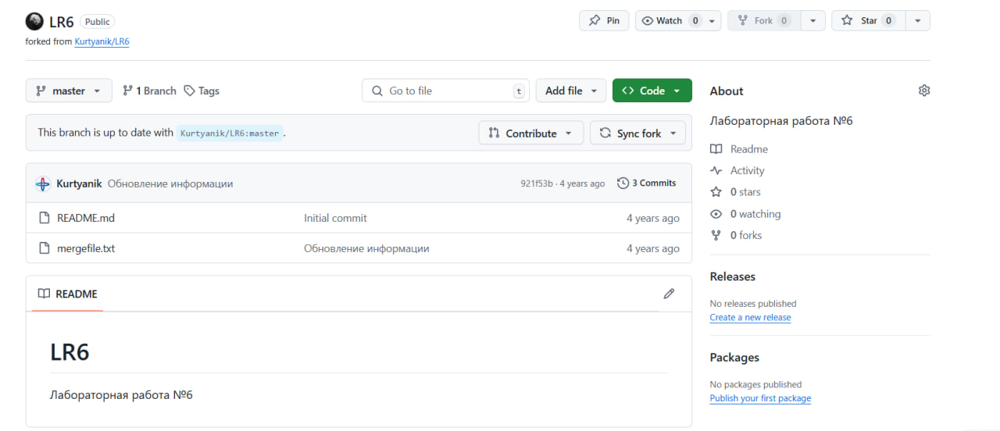
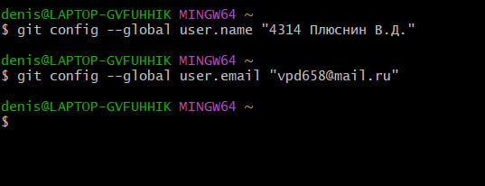
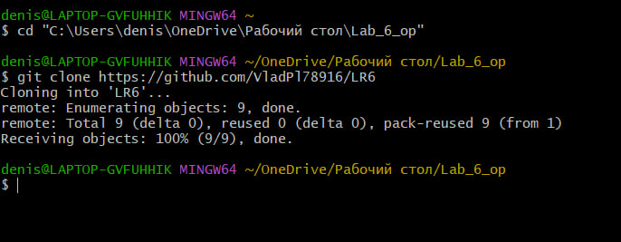
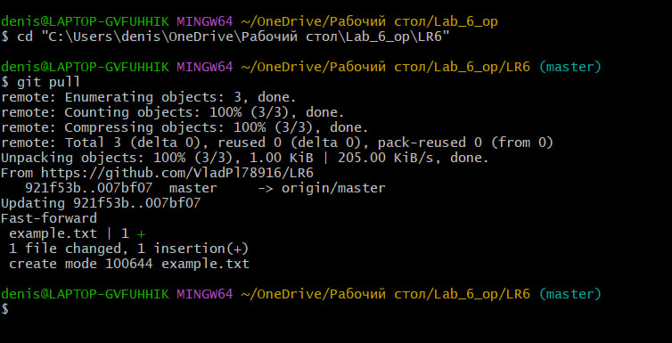
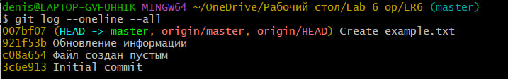

# LR6
Лабораторная работа №6

# Отчет по лабораторной работе №6
## Тема: Система контроля версий

## Цель лабораторной работы
Изучение базовых возможностей системы управления версиями, опыт работы с Git Api, опыт работы с локальным и
удаленным репозиторием. 

## Порядок выполнения работы
В ходе выполнения работы были выполнены следующие шаги:

### Шаг 1: Создание аккаунта на GitHub
Зарегистрирован аккаунт на сайте GitHub.

### Шаг 2: Форк репозитория
Форкнут репозиторий с заданием: [https://github.com/Kurtyanik/LR6](https://github.com/Kurtyanik/LR6).



### Шаг 3: Установка Git
Установлен Git с сайта [https://git-scm.com/](https://git-scm.com/).

### Шаг 4: Настройка Git
Настроен клиент Git с помощью следующих команд:

```bash
git config --global user.name "Группа Фамилия И.О."
git config --global user.email "ваш_емейл@example.com"
```


### Шаг 5: Клонирование репозитория

```bash
git clone https://github.com/Kurtyanik/LR6
```


### Шаг 6: Добавление файла через GitHub и подтягивание изменений
Добавлен файл через веб-интерфейс GitHub и изменения подтянуты локально:

```bash
git pull
```


### Шаг 7: Получение истории операций
Получена история операций для каждой ветки:

```bash
git log --oneline --all
```



