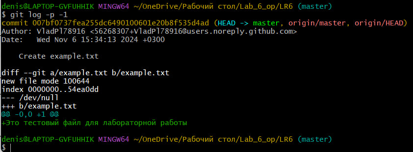
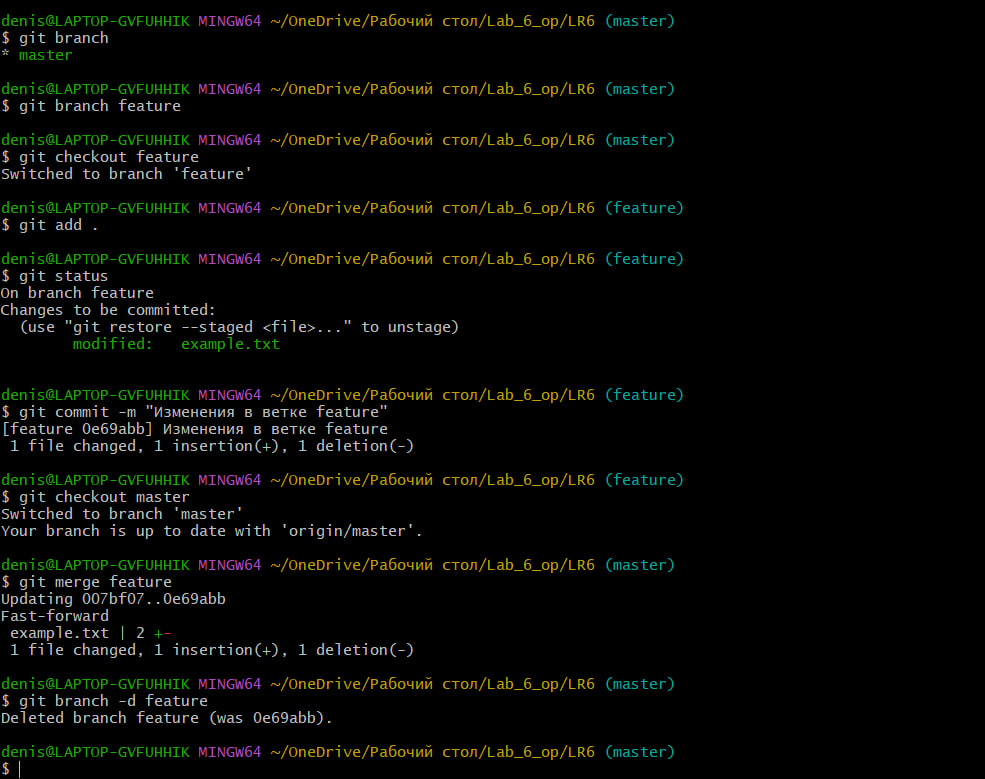
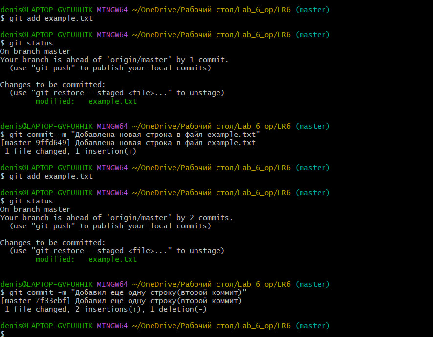
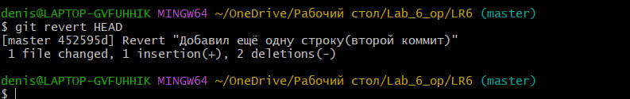
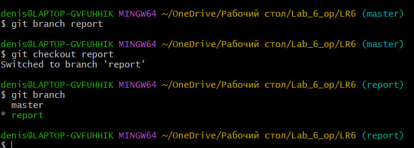

# LR6
Лабораторная работа №6

# Отчет по лабораторной работе №6
## Тема: Система контроля версий

## Цель лабораторной работы
Изучение базовых возможностей системы управления версиями, опыт работы с Git Api, опыт работы с локальным и
удаленным репозиторием. 

## Порядок выполнения работы
В ходе выполнения работы были выполнены следующие шаги:

### Шаг 1: Создание аккаунта на GitHub
Зарегистрирован аккаунт на сайте GitHub.

### Шаг 2: Форк репозитория
Форкнут репозиторий с заданием: [https://github.com/Kurtyanik/LR6](https://github.com/Kurtyanik/LR6).


### Шаг 3: Установка Git
Установлен Git с сайта [https://git-scm.com/](https://git-scm.com/).

### Шаг 4: Настройка Git
Настроен клиент Git с помощью следующих команд:

```bash
git config --global user.name "Группа Фамилия И.О."
git config --global user.email "ваш_емейл@example.com"
```


### Шаг 5: Клонирование репозитория

```bash
git clone https://github.com/Kurtyanik/LR6
```


### Шаг 6: Добавление файла через GitHub и подтягивание изменений
Добавлен файл через веб-интерфейс GitHub и изменения подтянуты локально:

```bash
git pull
```


### Шаг 7: Получение истории операций
Получена история операций для каждой ветки:

```bash
git log --oneline --all
```


### Шаг 8: Просмотр последних изменений
Посмотрены последние изменения:

```bash
git log -p -1
```


### Шаг 9: Слияние ветки и разрешение конфликта
Создана и слита ветка feature в master, конфликтов не возникло:

```bash
git checkout -b feature
# Внесены изменения
git add .
git commit -m "Внес изменения в feature"
git checkout master
git merge feature
```


### Шаг 10: Удаление побочной ветки
Удалена ветка feature после слияния:

```bash
git branch -d feature
```

### Шаг 11: Сделаны несколько коммитов с комментариями
Внесены изменения в файл example.txt (поочерёдно добавил две строки) и сделаны коммиты:

```bash
git add example.txt
git commit -m "Добавлена новая строка в файл example.txt"
git add example.txt
git commit -m "Добавил ещё одну строку(второй коммит).txt"
```


### Шаг 12: Откат коммита
Выполнен откат последнего коммита:

```bash
git add example.txt
git commit -m "Добавлена новая строка в файл example.txt"
git add example.txt
git commit -m "Добавил ещё одну строку(второй коммит).txt"
```



### Шаг 13: Создание ветки для отчета
Создана ветка report для оформления отчета:

```bash
git branch report
git checkout report
```

